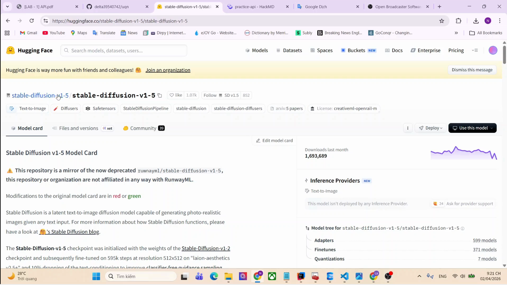

# practice-api
## Mô tả: bọc model tạo ảnh từ text thành api
## Thông tin model: ``runwayml/stable-diffusion-v1-5``
### các api
|phương thức|path|input|output|
|-----|----|----|----|
|``GET``|``/``|null|thông tin cơ bản về hệ thống và mô tả chức năng của api|
|``GET``|``/health``|null|thông tin về RAM, CPU, disk|
|``POST``|``/generate``|prompt: text|hình ảnh được nén dưới dạng Base64|
----
## Hướng dẫn chạy chương trình
### Điều kiện tiên quyết: 
|GPU|RAM|disk|
|----|-----|---|
|VRAM tối thiểu: 4GB|Tối thiểu: 8GB|~5GB - 10GB(cho model) + ~5-10GB(cho thư viện + môi trường ảo)|
### server host
**tải các thư viện cần cho dự án** (cell 1)
``!pip install -U diffusers fastapi nest-asyncio uvicorn psutil torch``
**chạy các cell 2-5** để cấu hình cơ bản và test tại cục bộ
**cell 6**: server đang chạy ở ``http://localhost:8000/``
**dán vào terminal``ssh -p 443 -R0:localhost:8000 qr@a.pinggy.io``
**link trả về từ terminal**: link công khai cho client gọi vào server.

***lưu ý***: chỉ chọn 1 trong 2

### client gọi API
**thay ``<your pinggy link>`` thành link thật (ex: ``https://odyrb-34-16-208-161.run.pinggy-free.link``)
**phương thức**: ``POST``
**đường dẫn**: ``/generate``
**tham số**: ``prompt: string``
**request**: 
```
payload = {
    "prompt": "your prompt"
}
response = requests.post(f"{API_URL}/generate", params=payload, timeout=120)
```
**response**: 
```
{
    "status": "success"|"fail",
    "status_code": <mã trạng thái>, // 200: ok
    "prompt": prompt, // prompt từ client
    "image_base64": f"data:image/png;base64,{base64_encoded_result}" // ảnh dạng nén base64 có phần đầu "data:image/png;base64,"
}
```
## video demo
[]([./video_demo/24120449.mp4](https://youtu.be/lmIHlk6UW7Q))
